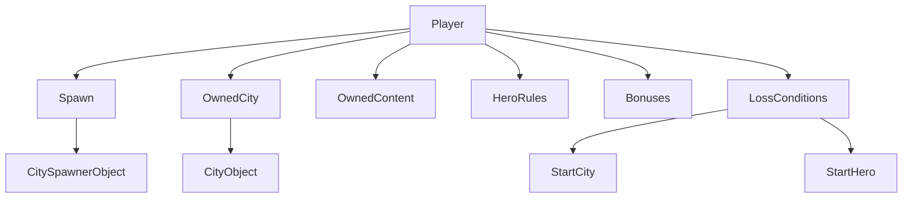

# Player

## Entity Card

- Name: `Player`
- Category: semantic game-side concept used by RMG
- Source Types: `ESpawn` usage in `RandomMapTemplate.MainObject`, `RandomMapTemplate.MandatoryContent`, `Generator.GetMetaInfo`, `MapObjectsRegistry`
- Authoring Representation: string side ids such as `Player1`, `Player2`
- Runtime Representation: spawn/owner enums carried into map objects and map settings
- References Out:
  - spawn main objects
  - city ownership
  - mandatory/generated content ownership
  - win/loss conditions
  - hero rules and bonuses
- References In:
  - `mainObject.spawn`
  - `mainObject.owner`
  - `mandatoryContent.owner`
  - game rules / bonuses / win conditions
- Critical Invariants:
  - player side ids must parse
  - player semantics are anchored by spawn ownership
- Editor Risks:
  - treating player as “just hero”
  - hiding ownership flows behind raw enum strings

## Code Fact

A player in RMG terms is a game side such as `Player1`, `Player2`, and is represented through spawn/owner fields rather than a standalone top-level player object.

## What A Player Has In RMG Terms

- a spawn anchor
- possibly one or more owned cities
- possibly owned mandatory/generated map content
- hero-count and hero-hire rules
- faction context through spawn and city/main-object faction resolution
- bonuses in some modes
- loss conditions tied to start city or start hero

## Observed In Shipped Templates

- duel maps use `Player1` and `Player2`
- FFA maps use up to `Player4`
- players are introduced through `Spawn` main objects and sometimes city `owner` fields

## Interconnection Diagram

## Inference

For editor purposes, `Player` should be modeled as a derived semantic node, not as free text scattered across fields.
