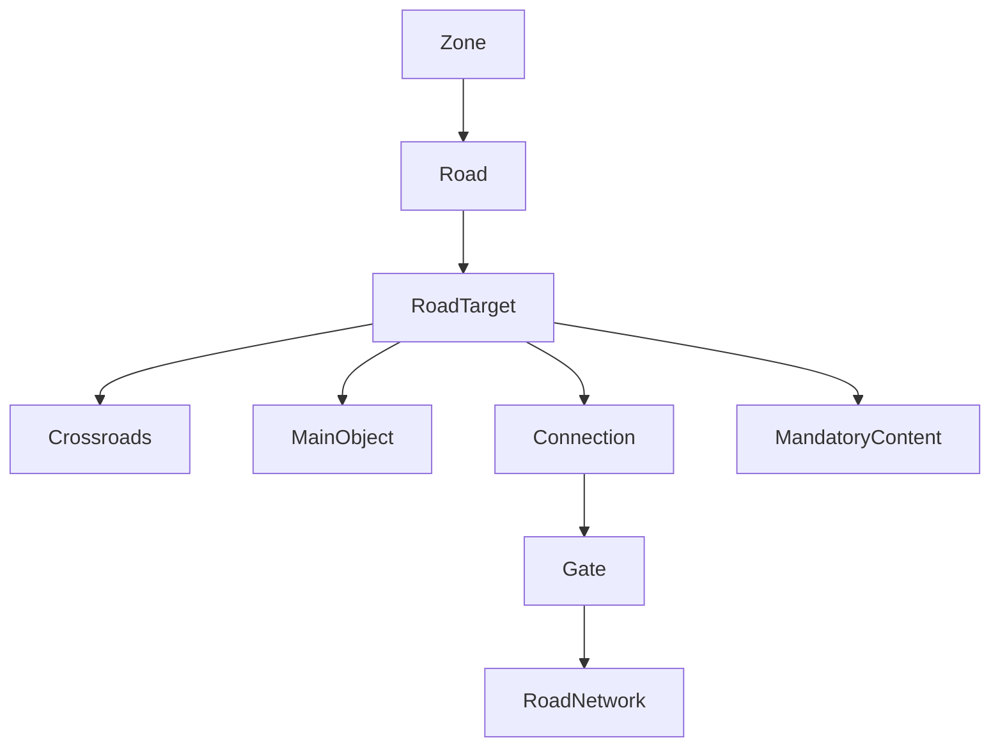

# Road Network

## Entity Card

- Name: `Road Network`
- Category: semantic traversal network
- Source Types: zone roads, connections, `Roads.cs`, `Gate`
- Authoring Representation: zone `roads[]` and connection graph
- Runtime Representation: road tiles plus road targets, gates, and encounter entrances
- References Out: zones, connections, main objects, mandatory content
- References In: road definitions and connection flags
- Critical Invariants: road target refs must stay valid
- Editor Risks: mixing authored roads with connection-level road booleans and inferred roads

## Diagram

## Code Fact

Road authoring is zone-local, but some endpoints target connection gates or mandatory content that only exist after resolution/placement.

## Observed In Shipped Templates

- all major target types are used
- some templates also include connection-level `road` booleans not represented in the inspected primary connection type

## Inference

Road editing must be split into:

- authored road instructions
- connection traversal semantics
- previewed final road tiles
