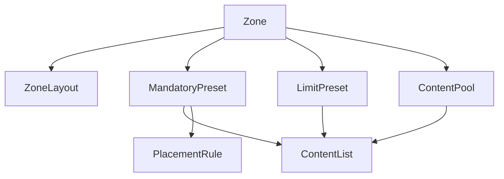

# Local Definition Usage

## Local Definition Types

- `zoneLayouts`
- `mandatoryContent`
- `contentCountLimits`
- `contentPools`
- `contentLists`

## Dependency Diagram

## Usage Rules

- these definitions are local to one template file
- same names across templates are not guaranteed equivalent
- rename/delete requires within-file reference updates only

## Observed In Shipped Templates

- all shipped templates define local `zoneLayouts`
- all shipped templates define local `mandatoryContent`
- all shipped templates define local `contentCountLimits`
